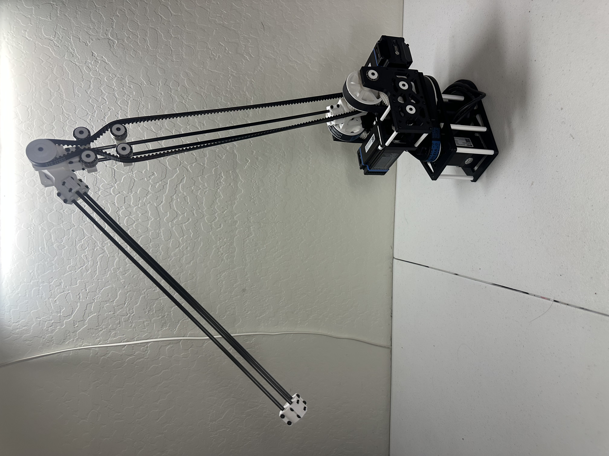
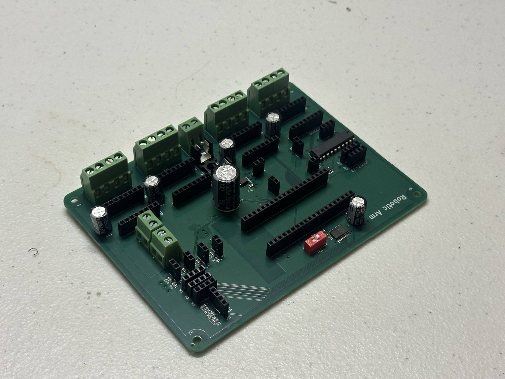
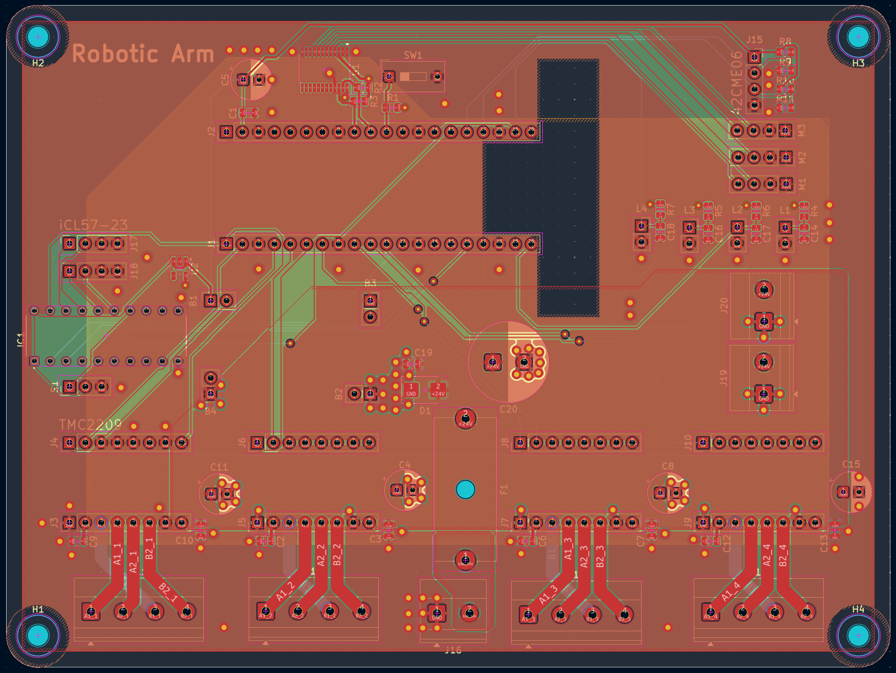

# 6-Axis Robotic Arm (Work in Progress)

An open-source, 6-DOF robotic arm featuring a custom mixed-architecture control board. The system offloads inverse kinematics (ROS 2 / Python) from a host laptop to an onboard Raspberry Pi Pico W analyzing encoder data and generating step signals.

---

## Hardware Overview

### Physical Structure
*(Mechanical design, joint assembly, and motor mounting.)*

  

### The Control Board (Physical PCB)
*(Custom board featuring 24V/5V/3.3V power distribution, stepper drivers, and I/O.)*

  

### Schematic
*(Designed in KiCad. Handles logic shifting via 74HCT245, limit switch & encoder monitoring, and I2C multiplexing.)*

  

### PCB Layout
*(Houses pin headers for reusability of all boards, thermal reliefs on 24V power pours, decoupling, and pull-up resistors.)*

  

---

## System Architecture

### Hardware Stack
*   **Microcontroller:** Raspberry Pi Pico W (RP2040)
*   **Power:** Mean Well LRS-200-24 (24V, 8.8A), DFR0831 Buck Converter (24V to 5V logic)
*   **Actuators:** 
    *   3x STEPPERONLINE Short Body NEMA 17 (Driven via A4988)
    *   1x Leadshine 42CME06 Closed-Loop (Driven via TMC2209)
    *   2x Leadshine iCL57-23 (Integrated Drivers)
*   **Feedback:** MT6701 Magnetic Encoders (I2C) & Leadshine Quadrature Encoders

### Software Stack (In Progress)
*   **Host (Laptop):** ROS 2, Python, MoveIt 2 (Inverse Kinematics, Trajectory Planning, URDF/Xacro modeling).
*   **Firmware (Pico W):** C++ (Pico SDK). 
    *   **Core 0:** Serial communication (micro-ROS/Custom protocol) & Emergency Stop hardware interrupts.
    *   **Core 1:** PID closed-loop feedback processing.
    *   **PIO:** Mathematically precise step/direction pulse generation for 6 axes.

---

## Development Roadmap

- [x] Mechanical Design and Manufacturing
- [x] PCB Design and Manufacturing
- [x] Finalize BOM and Sourcing
- [x] **[Current]** ROS 2 URDF, RViz2, and Gazebo simulation
- [ ] C++ Firmware: Step generation, and analyzing encoder data
- [ ] Communication between laptop and Pico (micro-ROS)
- [ ] Full integration of mechanical, electrical, and software components

---
